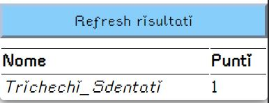

# quizabulous Project

## How it works?

This is pretty like "[Who Wants to Be a Millionaire?](https://en.wikipedia.org/wiki/Who_Wants_to_Be_a_Millionaire%3F)" TV show, but here can be more that one concurrent.<br/>
In your group define a person that will be the "master", others will be the competitors.

The master select or insert a new quest and start the poll, competitors will respond it in secret. After this the master stop the poll with a button and he can check the responses and the scores result.

## Configure application

You can download the application in tags section, is a Jar file, Java 8+ required. Or you can build it via Gradle.

Firstly create a new folder with name **conf**. In this folder create 2 new folders **quests** and **users**, the contents will be explained in next sections.

A configuration example is available in this repo, check the conf folder.

### Users folder

Inside the folder simply create a properties file (users.properties) with this structure: **Competitor_name**: _passcode_

Where the passcode is a secret password to give to the competitor.

Also you need to define a master and his passcode, to declare a master use a * as first character, e.g.

```json
*user1=pass1
user2=pass2
```

**user1** will be consider as  _master_ , **user2** will be a  _concurrent_ .


### Quests folder

Inside the folder create a JSON file (quests.json) with this structure:

```json
{
	"question": "string value", 
	"answer1": "string value",
	"answer2": "string value",
	"answer3": "string value",
	"answer4": "string value",
	"correctAnswer": number value (from 1 to 4)
}
```

This structure should be encapsulate in an array and can be repeated more time for example:

```json
[
	{
		"question": "What is the Italy capital", 
		"answer1": "Rome",
		"answer2": "Milan",
		"answer3": "Turin",
		"answer4": "Naples",
		"correctAnswer": 1
	},
	{
		"question": "What was the name of Amy Johnson’s plane in which she flew solo to Australia in 1930?", 
		"answer1": "Achilles",
		"answer2": "Pegasus",
		"answer3": "Hercules",
		"answer4": "Jason",
		"correctAnswer": 4
	}
]
```

In particular, the fields are:
 - **question**: the question text
 - **answer1**: The first answer
 - **answer2**: The second answer
 - **answer3**: The third answer
 - **answer4**: The fourth answer
 - **correctAnswer**: the number of the correct response
 
## How to use

After reached the home page, a login will be displayed


Here the competitors will insert the passcode configured, master will use his passcode as well.

### User guide

If you insert a competitor passcode, you will logged in and your configured name will appears on top near to logout button, under a text indicate the waiting from master's question.


After the master start the question, you can see the text and the response options.


User will select the option and press the button to send the response.


User can wait the next question.

### Master guide

If you are the master, your home page will have different functionalities.

In the top page you can see the **poll status**. It start close:


After a quest started, you can see the poll open and a button for close it.


Clicking on red button, you close the current poll quest and the system will calculate the results automatically. It can provide to you all user responses.


Next section is the **custom quest**, here you can insert the custom quest on-fly, for example:


Clicking the start button will start a new custom quest.

Under we can see the **Score list** section. Here you can see the actual score situation, a correct response will gain 1 point to the user.



The last section is the **start saved question**, all question saved in quests.json file are available here, you can select and start one saving game time.


<br><br><br>

This is all, have fun!

## Used technologies

This project uses Quarkus, the Supersonic Subatomic Java Framework.

If you want to learn more about Quarkus, please visit its website: https://quarkus.io/ .

Front End part was developed with Angular 11 Framework.

## Running the application in dev mode

You can run your application in dev mode that enables live coding using:

```shell script
./gradlew quarkusDev
```

> **_NOTE:_**  Quarkus now ships with a Dev UI, which is available in dev mode only at http://localhost/q/dev/.

## Packaging and running the application

The application can be packaged using:

```shell script
./gradlew build
```
It produces the `quizabulous-XXX-runner.jar` where _XXX_ is the version.

The application is now runnable using `java -jar quizabulous-XXX-runner.jar`.

__Java 8+ required__

## Related Guides

- RESTEasy JAX-RS ([guide](https://quarkus.io/guides/rest-json)): REST endpoint framework implementing JAX-RS and more

- MicroProfile JWT ([guide](https://quarkus.io/guides/security-jwt)): Create a user logged token with encryption and signature.

### RESTEasy JAX-RS

Easily start your RESTful Web Services

[Related guide section...](https://quarkus.io/guides/getting-started#the-jax-rs-resources)
